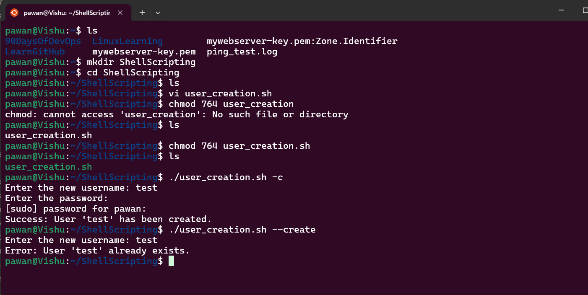
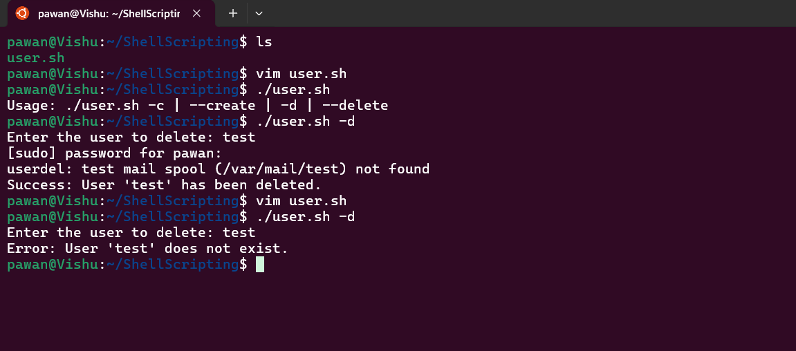

## Week 3 Challenge 1: User Account Management 

### Part 1: Account Creation

Here’s a Bash script that implements the user account creation functionality as described:
~~~
#!/bin/bash

# Function to create a user account
create_user() {
    read -p "Enter the new username: " username
    
    # Check if user already exists
    if id "$username" &>/dev/null; then
        echo "Error: User '$username' already exists."
        exit 1
    fi
    
    read -s -p "Enter the password: " password
    echo
    
    # Create the user and set the password
    sudo useradd -m "$username"
    echo "$username:$password" | sudo chpasswd
    
    echo "Success: User '$username' has been created."
}

# Check for command-line arguments
if [[ $# -eq 0 ]]; then
    echo "Usage: $0 -c | --create"
    exit 1
fi

# Parse command-line arguments
case "$1" in
    -c|--create)
        create_user
        ;;
    *)
        echo "Invalid option. Use -c or --create to create a new user."
        exit 1
        ;;
esac

~~~

Output: 

### Part 2: Account Deletion
Output:
